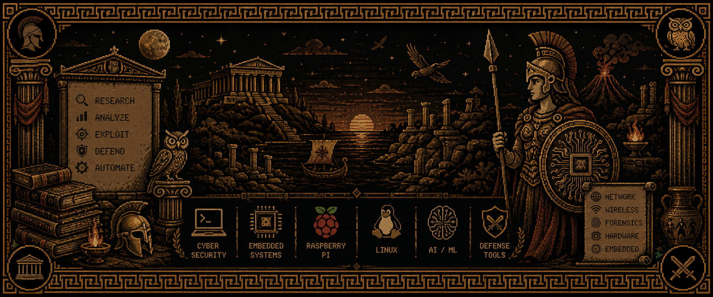

<p align="center">
  <h1 align="center">🏛️ Vrunalp199 </h1>
  
</p>
<div align="center">


### ⚡ Disciple of Athena • Cyber Security Researcher
### 🔥 Forge of Hephaestus • Embedded Systems Developer
### 🦉 Artificial Intelligence Enthusiast • Linux Power User


<br>


</div>

---

# 🏛️ Temple Records

```yaml
Name: Vrunal
Role: Cyber Security Researcher
Focus:
  - Raspberry Pi Development
  - Artificial Intelligence
  - Linux Administration
  - Network Security
  - Wireless Security
  

```

---

# ⚔️ Arsenal of Athena

### Web Application Security


### Vulnerability Assessment


### Network Analysis


### Wireless Security


### Packet Crafting


### Linux Security


---

### Microcontrollers


### Hardware Technologies

- RFID
- SPI
- I2C
- UART
- GPIO
- PoE Systems
- Embedded Linux
- Wireless Monitoring Systems

---

# 🦉 Languages & Technologies

<p align="center">


</p>


# ⚡ Streak of Hermes

<p align="center">


</p>

---

# 🏺 Artifacts of Olympus

### Featured Projects

🛡️ Raspberry Pi-Based Cyber Security Testing & Analysis Tool

📡 Wireless Packet Monitoring & Analysis Toolkit

🏷️ RFID & NFC Security Research Projects

🤖 Artificial Intelligence Experiments & Fine-Tuning

---

# 🌌 Philosophy

> "Knowledge without action is useless.
> Action without knowledge is dangerous."
>
> — Inspired by Athena

---

# 🤝 Connect

<p align="center">

<a href="https://github.com/vrunalp199">

</a>

</p>

---

<div align="center">

### 🏛️ ATHENA'S CYBER TEMPLE

⚔️ Cyber Security • 🔥 Embedded Systems • 🦉 Artificial Intelligence

</div>
